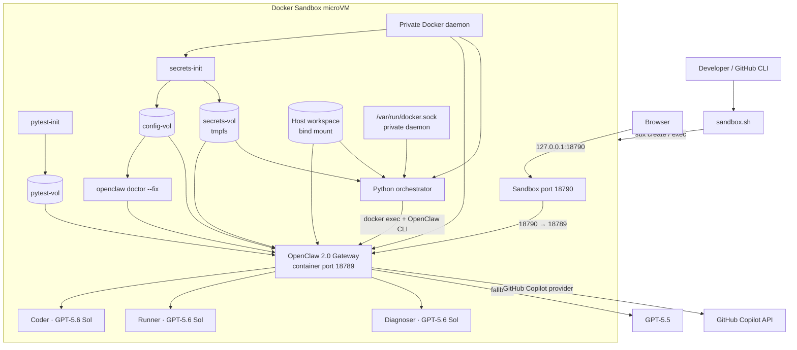
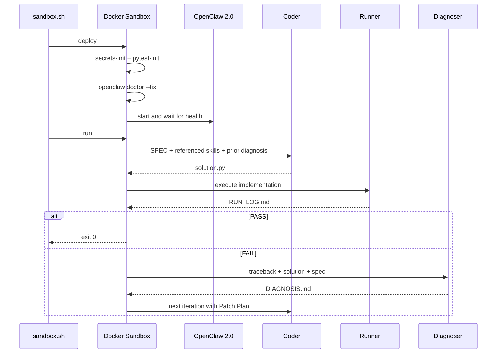
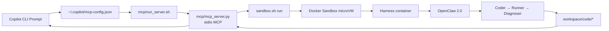

# CodingAgent · OpenClaw 2.0 on Docker Sandbox

CodingAgent is a GitHub Copilot-powered code-generation and self-correction loop running on **OpenClaw 2.0 (`2026.8.1`)** inside a **Docker Sandbox microVM**.

The project uses only these Copilot models:

- Primary: `github-copilot/gpt-5.6-sol`
- Fallback: `github-copilot/gpt-5.5`

Claude models are no longer configured.

## Architecture



The host runs only `sbx`. Docker Compose, containers, images, volumes, and `/var/run/docker.sock` live inside the isolated microVM. The socket mounted into the harness therefore controls only the sandbox's private Docker daemon.

### Component responsibilities

| Layer | Component | Responsibility |
|-------|-----------|----------------|
| Host control plane | `sandbox.sh` | Creates or reconnects to the microVM, injects the Copilot token, applies network policy, forwards port `18790`, and runs lifecycle commands |
| Isolation boundary | Docker Sandbox | Provides the private Docker daemon, filesystem, network, image store, and container runtime |
| Runtime configuration | `secrets-init` | Copies the tracked credential-free template to `config-vol`, injects the Gateway token, creates per-agent Copilot profiles, and assigns runtime ownership to UID 1000 |
| OpenClaw migration | `openclaw-init` | Runs `openclaw doctor --fix` against `config-vol` to migrate legacy auth profiles into the OpenClaw 2.0 SQLite secret store |
| Test toolchain | `pytest-init` | Installs `pytest==8.3.5` from the Microsoft package proxy into `pytest-vol` |
| Agent runtime | `openclaw` | Hosts Coder, Runner, and Diagnoser and calls GitHub Copilot |
| Orchestration | `harness` | Calls agents through the OpenClaw CLI, parses OpenClaw 2.0 payload responses, checks artifacts, and controls retry iterations |
| Shared output | `workspace/` | Keeps the specification, skills, generated implementation, smoke test, run log, and diagnosis visible on the host |

### Trust and persistence boundaries

- `config/openclaw.json` is only a template; live Gateway and Copilot credentials are written to `config-vol`, not to the Git working tree.
- `secrets-vol` is tmpfs-backed and contains the Gateway token.
- `pytest-vol` is mounted read-only into OpenClaw after initialization.
- `openclaw-init` mounts only `config-vol`, so configuration migration cannot rewrite the host workspace.
- The project workspace is the only host directory shared with the microVM.
- Port forwarding has two layers: host `18790` → microVM `18790` → OpenClaw container `18789`.
- OpenClaw's internal `agents.defaults.sandbox.mode` remains `off` because the complete Compose stack already runs inside the stronger Docker Sandbox microVM boundary.

## Pipeline

1. **Coder** reads `workspace/code/SPEC.md`, referenced `@SKILL.md` files, and any previous `DIAGNOSIS.md`, then writes `solution.py`.
2. **Runner** recreates `smoke_test.py` strictly from the specification, executes it with `python3` or runs an existing pytest suite from the read-only tool volume, and writes the complete output and traceback to `RUN_LOG.md`.
3. On failure, **Diagnoser** writes a structured patch plan to `DIAGNOSIS.md`.
4. The next iteration sends the diagnosis back to Coder until the run passes or `MAX_ITERATIONS` is exhausted.



`./sandbox.sh deploy` is the only command that reruns configuration and auth initialization. `./sandbox.sh run` uses `docker compose run --rm --no-deps harness`, so a pipeline run does not restart or mutate the healthy Gateway.

## What changed in the OpenClaw 2.0 migration

| Area | Previous implementation | Current implementation |
|------|-------------------------|------------------------|
| OpenClaw image | Floating `latest` / older 2026.5 configuration | Pinned official OpenClaw 2.0 image `2026.8.1` |
| Isolation | Compose on the host Docker daemon | Entire Compose stack inside a Docker Sandbox microVM |
| Models | Claude primary and fallback models | GPT-5.6 Sol primary with GPT-5.5 fallback |
| Agent schema | Legacy `agents.list` and `systemPromptOverride` | OpenClaw 2.0 `agents.entries`; task contracts are injected by the orchestrator |
| Authentication | Runtime credentials written under the tracked config directory | Credential-free template plus private `config-vol`, tmpfs secrets, and SQLite migration |
| CLI response handling | Legacy top-level reply shapes | OpenClaw 2.0 `result.payloads[].text` parsing |
| Python execution | Assumed `python` and runtime package installation | Uses `python3` and a pinned, read-only pytest volume |
| Pipeline lifecycle | Compose dependencies restarted for every run | Initialization occurs during `deploy`; `run` starts only an ephemeral harness |
| Smoke tests | Reused potentially stale generated tests | Recreated each iteration from the current SPEC and temporary capture files removed |

## Versions

| Component | Version |
|-----------|---------|
| OpenClaw 2.0 | `ghcr.io/openclaw/openclaw:2026.8.1` |
| Docker Sandboxes | `sbx 0.42.0` or later |
| Primary model | `github-copilot/gpt-5.6-sol` |
| Fallback model | `github-copilot/gpt-5.5` |
| Python | `3.12` |
| pytest | `8.3.5` |

OpenClaw uses date-based release tags. The official [v2026.8.1 release](https://docs.openclaw.ai/releases/2026.8.1) is named **OpenClaw 2.0**.

## Prerequisites

Docker Sandboxes on macOS requires Apple silicon and macOS 14 or later.

```bash
brew trust docker/tap
brew install docker/tap/sbx
# Upgrade an existing installation:
brew upgrade docker/tap/sbx
sbx login
```

Docker Desktop is not required. Each sandbox provides its own Docker daemon, filesystem, and network.

You also need a GitHub account with Copilot access and the GitHub CLI:

```bash
gh auth status
```

Model availability depends on the GitHub Copilot plan and organization policy. The account must expose GPT-5.6 Sol and GPT-5.5 in its live model catalog.

## Quick start

```bash
chmod +x sandbox.sh setup.sh security/secrets-init.sh
./sandbox.sh deploy
./sandbox.sh run
```

`sandbox.sh` reads `COPILOT_GITHUB_TOKEN` from the host environment or obtains it with `gh auth token`. The token is passed into the microVM for the command and is not written into the tracked OpenClaw configuration.

To provide the token explicitly:

```bash
export COPILOT_GITHUB_TOKEN="$(gh auth token)"
./sandbox.sh deploy
```

The deployment creates a sandbox named `codingagent-openclaw`, allocates 4 CPUs and 8 GiB RAM, publishes port `18790`, builds the harness, and starts OpenClaw.

At sandbox creation, `sandbox.sh` allows only the outbound hosts required for GitHub, GHCR, GitHub Copilot, and the Microsoft Python package proxy, including its Azure DevOps package and Blob redirect domains.

Override resources when required:

```bash
OPENCLAW_SANDBOX_CPUS=6 \
OPENCLAW_SANDBOX_MEMORY=12g \
./sandbox.sh deploy
```

## Commands

| Command | Purpose |
|---------|---------|
| `./sandbox.sh deploy` | Create the microVM, build images, and start OpenClaw |
| `./sandbox.sh run` | Execute the complete self-correction pipeline without restarting the Gateway |
| `./sandbox.sh status` | Show sandbox and Compose status |
| `./sandbox.sh logs` | Follow OpenClaw logs |
| `./sandbox.sh shell` | Open a shell in the microVM |
| `./sandbox.sh down` | Stop Compose services and retain the microVM |
| `sbx stop codingagent-openclaw` | Stop the microVM |
| `sbx rm codingagent-openclaw` | Delete the microVM and its internal state |

The OpenClaw Control UI is published at:

```text
http://127.0.0.1:18790/
```

## Configure a task

Edit `workspace/code/SPEC.md`. Skill references use this format:

```markdown
## Required Skills

- @PYTHON_STYLE.md
- @ALGO_PATTERNS.md
- @ERROR_HANDLING.md
- @TESTING.md
```

Referenced files must exist in `workspace/skills/`. Coder loads only the referenced skill documents to keep its context focused.

Generated files are written to `workspace/code/`:

| File | Producer | Purpose |
|------|----------|---------|
| `solution.py` | Coder | Generated implementation |
| `smoke_test.py` | Runner | Test generated from the current SPEC |
| `RUN_LOG.md` | Runner | Command, exit code, stdout, and full traceback |
| `DIAGNOSIS.md` | Diagnoser | Root cause and patch plan after a failed run |

## Model configuration

`config/openclaw.json` uses OpenClaw's built-in [GitHub Copilot provider](https://docs.openclaw.ai/providers/github-copilot):

```json
{
  "agents": {
    "defaults": {
      "model": {
        "primary": "github-copilot/gpt-5.6-sol",
        "fallbacks": ["github-copilot/gpt-5.5"]
      }
    }
  }
}
```

GPT models use OpenClaw's OpenAI Responses transport. Live model availability is discovered from the Copilot API for the authenticated account.

## Credential handling

`config/openclaw.json` is a credential-free template. At startup:

1. `secrets-init` copies the template into the private `config-vol`.
2. It generates or reuses the Gateway token in the tmpfs-backed `secrets-vol`.
3. It injects the Gateway token into the runtime configuration.
4. It creates runtime-only Copilot auth profiles for Coder, Runner, and Diagnoser.
5. `openclaw doctor --fix` migrates those profiles into OpenClaw 2.0's SQLite-backed secret store before the Gateway starts.
6. `pytest-init` installs pinned `pytest==8.3.5` from the Microsoft package proxy into a read-only tool volume.

For interactive device authentication, use the command documented by OpenClaw:

```bash
./sandbox.sh shell
docker exec -it codingagent-openclaw \
  node /app/openclaw.mjs models auth login-github-copilot
```

For normal automated runs, `sandbox.sh` supplies `COPILOT_GITHUB_TOKEN`.

## Docker Sandbox isolation

Docker Sandboxes gives the project:

- A dedicated microVM boundary.
- A private Docker daemon and image store.
- An isolated filesystem and network.
- Explicit workspace sharing and port forwarding.
- Sandbox-specific outbound network policy.

The project directory is mounted at the same absolute path inside the microVM. Changes under `workspace/` therefore remain visible on the host, while containers and Docker volumes remain isolated inside the sandbox.

See the official [Docker Sandboxes documentation](https://docs.docker.com/ai/sandboxes/).

## GitHub Copilot CLI MCP integration

The repeatable installer `mcp/install_copilot_cli.sh` registers `codingagent` in the current user's GitHub Copilot CLI configuration. The stdio server is launched by `mcp/run_server.sh` and exposes:

| MCP tool | Purpose |
|----------|---------|
| `codingagent_list_skills` | List available Skill documents |
| `codingagent_read_skill` | Read one Skill document |
| `codingagent_add_skill` | Add or replace a Skill document |
| `codingagent_generate` | Write a SPEC and run the complete Docker Sandbox self-correction pipeline |

### Binding flow

1. Install the Python MCP SDK.
2. Deploy OpenClaw in Docker Sandbox.
3. Run `mcp/install_copilot_cli.sh`.
4. The installer replaces any stale `codingagent` registration with the absolute launcher path.
5. Copilot CLI starts `mcp/run_server.sh` as a local stdio process when an MCP tool is needed.
6. The launcher sets `CODINGAGENT_ROOT` and starts `mcp/mcp_server.py`.
7. `codingagent_generate` writes the requested SPEC and calls `sandbox.sh run`.
8. `sandbox.sh` passes the iteration limit and Copilot credential into the microVM, where the ephemeral Harness drives OpenClaw.



### Install and bind

Install the Python MCP SDK from the Microsoft package source if it is not already available:

```bash
python3 -m pip install \
  --index-url https://packagefeedproxy.microsoft.io/pypi/simple \
  -r mcp/requirements.txt
```

Install or refresh the Copilot CLI registration:

```bash
chmod +x mcp/install_copilot_cli.sh mcp/run_server.sh
./mcp/install_copilot_cli.sh
```

The installer executes the equivalent of:

```bash
copilot mcp remove codingagent  # ignored when no previous registration exists
copilot mcp add --tools '*' codingagent -- /path/to/CodingAgent/mcp/run_server.sh
```

Copilot CLI persists a user-level entry similar to:

```json
{
  "mcpServers": {
    "codingagent": {
      "type": "local",
      "command": "/path/to/CodingAgent/mcp/run_server.sh",
      "args": [],
      "tools": ["*"]
    }
  }
}
```

The configuration contains no GitHub or Gateway token. `sandbox.sh` reads `COPILOT_GITHUB_TOKEN` from the process environment or securely obtains it through `gh auth token` when a generation tool runs.

Confirm discovery:

```bash
copilot mcp list
copilot mcp get codingagent
```

Start the OpenClaw service before invoking generation:

```bash
./sandbox.sh deploy
```

### Interactive invocation

Start Copilot CLI from `CodingAgent/`:

```bash
copilot
```

Inside the interactive session, inspect the server:

```text
/mcp show codingagent
```

List the available skills:

```text
Call codingagent_list_skills exactly once and return the available skills.
```

Run code generation:

```text
Call codingagent_generate to implement a thread-safe LRU cache.

Requirements:
- Reference @PYTHON_STYLE.md, @ALGO_PATTERNS.md, and @ERROR_HANDLING.md.
- Set max_iterations to 4.
- Run the pipeline until PASS.
- Return solution.py and RUN_LOG.md.
```

Copilot selects the MCP tool from the prompt. Naming `codingagent_generate` explicitly prevents the request from being handled as a normal in-process coding task.

### Non-interactive invocation

List skills from a shell:

```bash
copilot --allow-all-tools --no-remote -p \
  "Call codingagent_list_skills exactly once. Return only the tool result."
```

Run a complete generation pipeline:

```bash
copilot --allow-all-tools --no-remote -p '
Call codingagent_generate exactly once with max_iterations=4.

Implement fibonacci(n: int) -> int.
Reference @PYTHON_STYLE.md and @TESTING.md.
Reject negative values with ValueError.
Include a Smoke Test and run until PASS.
Return the Pipeline Result and solution.py.
'
```

`--allow-all-tools` is required in non-interactive mode so Copilot can approve the MCP call without displaying a confirmation prompt. `--no-remote` keeps the CLI session local.

### MCP-generated files

`codingagent_generate` replaces the active files under `workspace/code/`:

- `SPEC.md`
- `solution.py`
- `smoke_test.py` or `test_solution.py`
- `RUN_LOG.md`
- `DIAGNOSIS.md` when a failed iteration requires correction

Use the MCP generation tool serially. Concurrent calls share the same workspace and can overwrite each other's task and output files.

The deployed integration has been exercised through Copilot CLI with both `codingagent_list_skills` and `codingagent_generate`; the full Docker Sandbox generation test completed with `PASS`.

### MCP server implementation

`mcp/mcp_server.py` uses the Python MCP SDK and stdio transport. It does not open a network listener.

| Implementation stage | Behavior |
|----------------------|----------|
| Tool discovery | Returns the four tool schemas through MCP `list_tools` |
| Skill validation | Resolves `@FILE.md` references against `workspace/skills/` and reports missing references |
| Run preparation | Removes stale generated artifacts and writes the new `workspace/code/SPEC.md` |
| Sandbox execution | Runs `sandbox.sh run` with the requested `MAX_ITERATIONS` and timeout |
| Result parsing | Reads `RUN_LOG.md`, determines `PASS` or `FAIL`, and collects `solution.py` and `DIAGNOSIS.md` |
| MCP response | Returns the pipeline result and generated files as MCP text content |

The MCP process runs on the host only because Copilot CLI communicates with it over stdin/stdout. All code execution, containers, Docker volumes, and the Docker socket remain inside the Docker Sandbox microVM.

The existing `opencode.json` continues to expose the same MCP server to OpenCode. Both clients now call `sandbox.sh run`; neither invokes the host Docker daemon directly.

Direct command-line execution remains available:

```bash
./sandbox.sh run
```

## Troubleshooting

| Symptom | Resolution |
|---------|------------|
| `sbx` cannot start | Confirm Apple silicon, macOS 14+, `sbx login`, and sufficient memory |
| Gateway health check fails | Run `./sandbox.sh logs` and inspect OpenClaw startup |
| Copilot authentication fails | Confirm `gh auth status` and that the account has Copilot access |
| `codingagent` is not listed | Run `./mcp/install_copilot_cli.sh`, then check `copilot mcp get codingagent` |
| MCP process cannot import `mcp` | Install `mcp/requirements.txt` with the documented Microsoft Python package source |
| Copilot does not call the tool | Name `codingagent_generate` or `codingagent_list_skills` explicitly in the prompt |
| Model not found | Inspect the live catalog inside the microVM and verify organization policy permits GPT-5.6 Sol |
| Harness cannot access Docker | Recreate the sandbox; the mounted socket must belong to the microVM daemon |
| Port `18790` is unavailable | Stop the conflicting process or set a different published port in `sandbox.sh` |

Inspect the model catalog:

```bash
sbx exec codingagent-openclaw \
  docker exec codingagent-openclaw \
  node /app/openclaw.mjs models list
```

## Shutdown

```bash
./sandbox.sh down
sbx stop codingagent-openclaw
```

To remove all sandbox-local images, containers, and volumes:

```bash
sbx rm codingagent-openclaw
```
