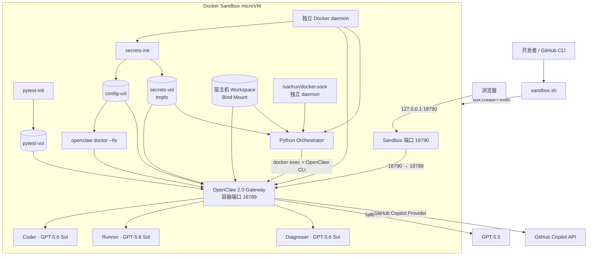
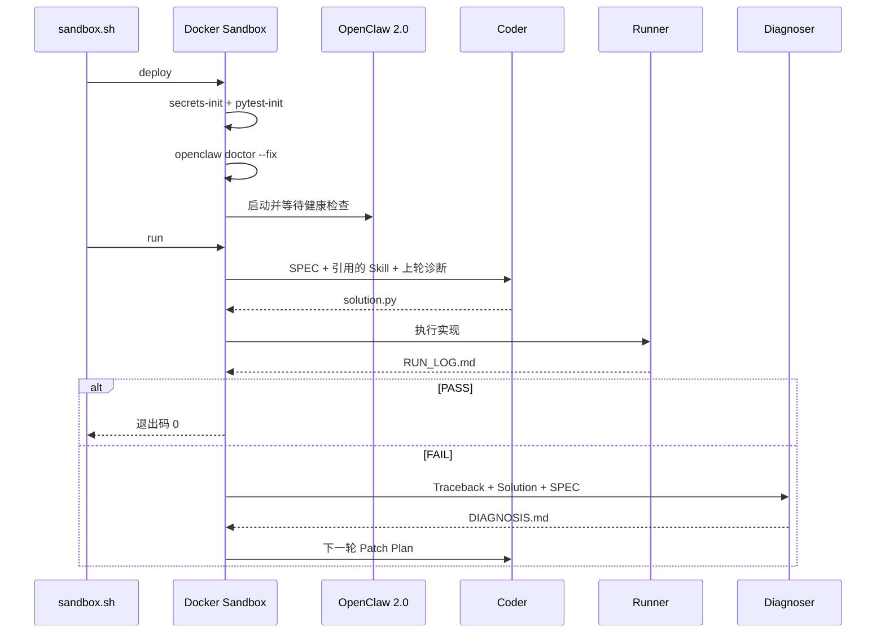
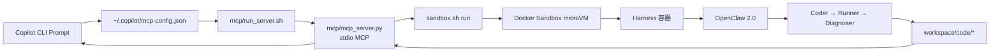

# CodingAgent · 基于 Docker Sandbox 的 OpenClaw 2.0

CodingAgent 是一个运行于 **Docker Sandbox microVM** 内的代码生成与自修复闭环，底层使用 **OpenClaw 2.0（`2026.8.1`）** 和 GitHub Copilot。

项目只使用以下模型：

- 主模型：`github-copilot/gpt-5.6-sol`
- 备用模型：`github-copilot/gpt-5.5`

配置中已不再使用 Claude 模型。

## 架构



宿主机只运行 `sbx`。Docker Compose、容器、镜像、Volume 和 `/var/run/docker.sock` 全部位于隔离的 microVM 内。因此 Harness 挂载的 Socket 只能控制 Sandbox 内部的 Docker daemon，不能操作宿主机容器。

### 组件职责

| 层级 | 组件 | 职责 |
|------|------|------|
| 宿主机控制面 | `sandbox.sh` | 创建或重新连接 microVM、注入 Copilot Token、应用网络策略、转发 `18790` 端口并执行生命周期命令 |
| 隔离边界 | Docker Sandbox | 提供独立 Docker daemon、文件系统、网络、镜像存储和容器运行时 |
| 运行时配置 | `secrets-init` | 将无凭据模板复制到 `config-vol`，注入 Gateway Token，生成 Agent Copilot Profile，并将运行时目录所有权交给 UID 1000 |
| OpenClaw 迁移 | `openclaw-init` | 对 `config-vol` 执行 `openclaw doctor --fix`，将旧 Auth Profile 迁移到 OpenClaw 2.0 SQLite Secret Store |
| 测试工具链 | `pytest-init` | 从 Microsoft 包代理安装 `pytest==8.3.5` 到 `pytest-vol` |
| Agent 运行时 | `openclaw` | 托管 Coder、Runner、Diagnoser，并调用 GitHub Copilot |
| 编排层 | `harness` | 通过 OpenClaw CLI 调用 Agent、解析 OpenClaw 2.0 Payload、检查产物并控制重试 |
| 共享产物 | `workspace/` | 保存 SPEC、Skill、生成代码、Smoke Test、运行日志和诊断，宿主机可直接查看 |

### 信任与持久化边界

- `config/openclaw.json` 只是模板；真实 Gateway 和 Copilot 凭据写入私有 `config-vol`，不会进入 Git 工作区。
- `secrets-vol` 使用 tmpfs，保存 Gateway Token。
- `pytest-vol` 初始化后以只读方式挂载到 OpenClaw。
- `openclaw-init` 只挂载 `config-vol`，配置迁移不能修改宿主机 Workspace。
- 项目 Workspace 是唯一共享给 microVM 的宿主机目录。
- 端口经过两层转发：宿主机 `18790` → microVM `18790` → OpenClaw 容器 `18789`。
- OpenClaw 内部的 `agents.defaults.sandbox.mode` 保持 `off`，因为整个 Compose Stack 已运行在隔离能力更强的 Docker Sandbox microVM 边界内。

## 执行闭环

1. **Coder** 读取 `workspace/code/SPEC.md`、被引用的 `@SKILL.md` 和上一轮 `DIAGNOSIS.md`，生成 `solution.py`。
2. **Runner** 严格根据 SPEC 重新生成 `smoke_test.py`，使用 `python3` 执行，或通过只读工具 Volume 运行已有 pytest，并将命令、退出码、标准输出和完整 Traceback 写入 `RUN_LOG.md`。
3. 执行失败时，**Diagnoser** 将根因和修复计划写入 `DIAGNOSIS.md`。
4. 下一轮 Coder 根据修复计划继续修改，直到通过或达到 `MAX_ITERATIONS`。



只有 `./sandbox.sh deploy` 会重新执行配置和鉴权初始化。`./sandbox.sh run` 使用 `docker compose run --rm --no-deps harness`，因此执行流水线时不会重启或修改健康运行的 Gateway。

## OpenClaw 2.0 迁移变更

| 范围 | 旧实现 | 当前实现 |
|------|--------|----------|
| OpenClaw 镜像 | 浮动 `latest` / 旧版 2026.5 配置 | 固定官方 OpenClaw 2.0 镜像 `2026.8.1` |
| 隔离方式 | Compose 使用宿主机 Docker daemon | 整个 Compose Stack 运行于 Docker Sandbox microVM |
| 模型 | Claude 主模型和备用模型 | GPT-5.6 Sol 主模型，GPT-5.5 Fallback |
| Agent Schema | 旧 `agents.list` 和 `systemPromptOverride` | OpenClaw 2.0 `agents.entries`，任务合同由 Orchestrator 每轮注入 |
| 鉴权 | 运行时凭据写入被跟踪的配置目录 | 无凭据模板、私有 `config-vol`、tmpfs Secret 和 SQLite 迁移 |
| CLI 响应 | 旧顶层 Reply 结构 | 解析 OpenClaw 2.0 `result.payloads[].text` |
| Python 执行 | 假设存在 `python` 并在运行时安装依赖 | 使用 `python3` 和固定版本只读 pytest Volume |
| 流水线生命周期 | 每次运行都会重启 Compose 依赖 | `deploy` 负责初始化，`run` 只启动临时 Harness |
| Smoke Test | 可能复用旧任务生成的测试 | 每轮按当前 SPEC 重建，并删除临时捕获文件 |

## 版本

| 组件 | 版本 |
|------|------|
| OpenClaw 2.0 | `ghcr.io/openclaw/openclaw:2026.8.1` |
| Docker Sandboxes | `sbx 0.42.0` 或更高 |
| 主模型 | `github-copilot/gpt-5.6-sol` |
| 备用模型 | `github-copilot/gpt-5.5` |
| Python | `3.12` |
| pytest | `8.3.5` |

OpenClaw 使用日期形式的版本号。官方 [v2026.8.1 发布说明](https://docs.openclaw.ai/releases/2026.8.1) 将该版本命名为 **OpenClaw 2.0**。

## 环境要求

macOS 使用 Docker Sandboxes 时，需要 Apple silicon 和 macOS 14 或更高版本。

```bash
brew trust docker/tap
brew install docker/tap/sbx
# 已安装时升级：
brew upgrade docker/tap/sbx
sbx login
```

无需 Docker Desktop。每个 Sandbox 都有独立的 Docker daemon、文件系统和网络。

还需要具有 Copilot 权限的 GitHub 账户及 GitHub CLI：

```bash
gh auth status
```

模型可用性取决于 Copilot 套餐和组织策略，账户必须能够访问 GPT-5.6 Sol 和 GPT-5.5。

## 快速开始

```bash
chmod +x sandbox.sh setup.sh security/secrets-init.sh
./sandbox.sh deploy
./sandbox.sh run
```

`sandbox.sh` 优先读取宿主机环境变量 `COPILOT_GITHUB_TOKEN`，未设置时调用 `gh auth token`。Token 只在执行命令时传入 microVM，不会写入被 Git 跟踪的 OpenClaw 配置。

也可以显式设置：

```bash
export COPILOT_GITHUB_TOKEN="$(gh auth token)"
./sandbox.sh deploy
```

默认会创建名为 `codingagent-openclaw` 的 Sandbox，分配 4 CPU、8 GiB 内存，转发 `18790` 端口，构建 Harness 并启动 OpenClaw。

首次创建 Sandbox 时，`sandbox.sh` 只放行 GitHub、GHCR、GitHub Copilot 和 Microsoft Python 包代理所需的出站域名，包括 Azure DevOps Package 与 Blob 重定向域名。

需要更多资源时：

```bash
OPENCLAW_SANDBOX_CPUS=6 \
OPENCLAW_SANDBOX_MEMORY=12g \
./sandbox.sh deploy
```

## 管理命令

| 命令 | 用途 |
|------|------|
| `./sandbox.sh deploy` | 创建 microVM、构建镜像并启动 OpenClaw |
| `./sandbox.sh run` | 不重启 Gateway，直接执行完整自修复流水线 |
| `./sandbox.sh status` | 查看 Sandbox 和 Compose 状态 |
| `./sandbox.sh logs` | 跟踪 OpenClaw 日志 |
| `./sandbox.sh shell` | 进入 microVM Shell |
| `./sandbox.sh down` | 停止 Compose 服务但保留 microVM |
| `sbx stop codingagent-openclaw` | 停止 microVM |
| `sbx rm codingagent-openclaw` | 删除 microVM 及其内部状态 |

OpenClaw Control UI 地址：

```text
http://127.0.0.1:18790/
```

## 配置任务

编辑 `workspace/code/SPEC.md`，通过以下格式引用 Skill：

```markdown
## Required Skills

- @PYTHON_STYLE.md
- @ALGO_PATTERNS.md
- @ERROR_HANDLING.md
- @TESTING.md
```

引用的文件必须位于 `workspace/skills/`。Coder 只加载明确引用的 Skill，避免无关上下文。

生成产物位于 `workspace/code/`：

| 文件 | 生成者 | 用途 |
|------|--------|------|
| `solution.py` | Coder | 最终实现 |
| `smoke_test.py` | Runner | 根据当前 SPEC 生成的测试 |
| `RUN_LOG.md` | Runner | 命令、退出码、标准输出和完整 Traceback |
| `DIAGNOSIS.md` | Diagnoser | 失败根因和 Patch Plan |

## 模型配置

`config/openclaw.json` 使用 OpenClaw 内置的 [GitHub Copilot Provider](https://docs.openclaw.ai/providers/github-copilot)：

```json
{
  "agents": {
    "defaults": {
      "model": {
        "primary": "github-copilot/gpt-5.6-sol",
        "fallbacks": ["github-copilot/gpt-5.5"]
      }
    }
  }
}
```

GPT 模型使用 OpenClaw 的 OpenAI Responses Transport。OpenClaw 会根据当前 Copilot 账户实时发现可用模型。

## 凭据处理

`config/openclaw.json` 现在只是无凭据模板。启动时：

1. `secrets-init` 将模板复制到私有 `config-vol`。
2. 在 tmpfs 类型的 `secrets-vol` 中生成或复用 Gateway Token。
3. 将 Gateway Token 注入运行时配置。
4. 为 Coder、Runner 和 Diagnoser 创建仅存在于运行时 Volume 的 Copilot Auth Profile。
5. Gateway 启动前执行 `openclaw doctor --fix`，将 Auth Profile 迁移到 OpenClaw 2.0 的 SQLite Secret Store。
6. `pytest-init` 从 Microsoft 包代理安装固定版本 `pytest==8.3.5`，并以只读工具 Volume 提供给 Runner。

如需使用 OpenClaw 官方 Device Flow：

```bash
./sandbox.sh shell
docker exec -it codingagent-openclaw \
  node /app/openclaw.mjs models auth login-github-copilot
```

日常自动运行由 `sandbox.sh` 提供 `COPILOT_GITHUB_TOKEN`。

## Docker Sandbox 隔离

Docker Sandboxes 为项目提供：

- 独立 microVM 隔离边界；
- 私有 Docker daemon 和镜像存储；
- 隔离的文件系统与网络；
- 显式的 Workspace 共享和端口转发；
- Sandbox 级出站网络策略。

项目目录在 microVM 内保持相同的绝对路径，因此 `workspace/` 下的改动会同步显示在宿主机；容器、镜像和 Docker Volume 则只存在于 Sandbox 内部。

官方文档：[Docker Sandboxes](https://docs.docker.com/ai/sandboxes/)。

## GitHub Copilot CLI MCP 集成

可重复执行的安装脚本 `mcp/install_copilot_cli.sh` 会将 `codingagent` 注册到当前用户的 GitHub Copilot CLI 配置。`mcp/run_server.sh` 启动 stdio MCP Server，并提供：

| MCP 工具 | 用途 |
|----------|------|
| `codingagent_list_skills` | 列出可用 Skill 文档 |
| `codingagent_read_skill` | 读取指定 Skill |
| `codingagent_add_skill` | 新增或替换 Skill |
| `codingagent_generate` | 写入 SPEC，并执行完整 Docker Sandbox 自修复流水线 |

### 绑定流程

1. 安装 Python MCP SDK。
2. 在 Docker Sandbox 中部署 OpenClaw。
3. 执行 `mcp/install_copilot_cli.sh`。
4. 安装脚本使用 Launcher 的绝对路径替换旧的 `codingagent` 注册。
5. Copilot CLI 需要 MCP 工具时，将 `mcp/run_server.sh` 作为本地 stdio 进程启动。
6. Launcher 设置 `CODINGAGENT_ROOT` 并启动 `mcp/mcp_server.py`。
7. `codingagent_generate` 写入用户提供的 SPEC，然后调用 `sandbox.sh run`。
8. `sandbox.sh` 将迭代次数和 Copilot 凭据传入 microVM，由临时 Harness 驱动 OpenClaw。



### 安装与绑定

如果本机尚未安装 Python MCP SDK，请通过 Microsoft 包源安装：

```bash
python3 -m pip install \
  --index-url https://packagefeedproxy.microsoft.io/pypi/simple \
  -r mcp/requirements.txt
```

安装或刷新 Copilot CLI 注册：

```bash
chmod +x mcp/install_copilot_cli.sh mcp/run_server.sh
./mcp/install_copilot_cli.sh
```

安装脚本等价执行：

```bash
copilot mcp remove codingagent  # 没有旧注册时忽略
copilot mcp add --tools '*' codingagent -- /path/to/CodingAgent/mcp/run_server.sh
```

Copilot CLI 会保存类似下面的用户级配置：

```json
{
  "mcpServers": {
    "codingagent": {
      "type": "local",
      "command": "/path/to/CodingAgent/mcp/run_server.sh",
      "args": [],
      "tools": ["*"]
    }
  }
}
```

配置中不保存 GitHub Token 或 Gateway Token。执行生成工具时，`sandbox.sh` 从进程环境读取 `COPILOT_GITHUB_TOKEN`；未设置时，通过 `gh auth token` 安全获取。

确认 Copilot CLI 已发现服务：

```bash
copilot mcp list
copilot mcp get codingagent
```

调用生成工具前先启动 OpenClaw 服务：

```bash
./sandbox.sh deploy
```

### 交互模式调用

从 `CodingAgent/` 启动 Copilot CLI：

```bash
copilot
```

进入交互模式后查看服务：

```text
/mcp show codingagent
```

列出可用 Skill：

```text
请调用 codingagent_list_skills 一次，并返回所有可用 Skill。
```

执行代码生成：

```text
请调用 codingagent_generate，实现一个线程安全的 LRU Cache。

要求：
- 引用 @PYTHON_STYLE.md、@ALGO_PATTERNS.md 和 @ERROR_HANDLING.md。
- max_iterations 设置为 4。
- 执行流水线直到 PASS。
- 返回 solution.py 和 RUN_LOG.md。
```

Copilot 会根据 Prompt 选择 MCP 工具。明确写出 `codingagent_generate`，可以避免该请求被当作普通的 CLI 内部编码任务处理。

### 非交互模式调用

在 Shell 中列出 Skill：

```bash
copilot --allow-all-tools --no-remote -p \
  "Call codingagent_list_skills exactly once. Return only the tool result."
```

执行完整代码生成流水线：

```bash
copilot --allow-all-tools --no-remote -p '
Call codingagent_generate exactly once with max_iterations=4.

Implement fibonacci(n: int) -> int.
Reference @PYTHON_STYLE.md and @TESTING.md.
Reject negative values with ValueError.
Include a Smoke Test and run until PASS.
Return the Pipeline Result and solution.py.
'
```

非交互模式需要 `--allow-all-tools`，让 Copilot 无需显示确认界面即可调用 MCP。`--no-remote` 用于保持 CLI Session 在本地运行。

### MCP 生成产物

`codingagent_generate` 会替换 `workspace/code/` 下当前任务相关文件：

- `SPEC.md`
- `solution.py`
- `smoke_test.py` 或 `test_solution.py`
- `RUN_LOG.md`
- 失败迭代需要修复时生成的 `DIAGNOSIS.md`

请串行调用 MCP 生成工具。多个并发调用会共享同一个 Workspace，可能互相覆盖任务和产物。

当前部署已经通过 Copilot CLI 实际调用 `codingagent_list_skills` 和 `codingagent_generate`；完整 Docker Sandbox 生成测试结果为 `PASS`。

### MCP Server 实现

`mcp/mcp_server.py` 使用 Python MCP SDK 和 stdio Transport，不会开放网络监听端口。

| 实现阶段 | 行为 |
|----------|------|
| 工具发现 | 通过 MCP `list_tools` 返回 4 个工具 Schema |
| Skill 校验 | 在 `workspace/skills/` 中解析 `@FILE.md`，并报告缺失引用 |
| 运行准备 | 删除旧生成产物，并写入新的 `workspace/code/SPEC.md` |
| Sandbox 执行 | 按请求的 `MAX_ITERATIONS` 和 Timeout 执行 `sandbox.sh run` |
| 结果解析 | 读取 `RUN_LOG.md` 判断 `PASS` 或 `FAIL`，并收集 `solution.py` 与 `DIAGNOSIS.md` |
| MCP 返回 | 通过 MCP Text Content 返回流水线结果和生成文件 |

MCP 进程必须运行在宿主机，是因为 Copilot CLI 通过 stdin/stdout 与它通信。真正的代码执行、容器、Docker Volume 和 Docker Socket 仍全部位于 Docker Sandbox microVM 内。

现有 `opencode.json` 仍可让 OpenCode 使用同一 MCP Server。两个客户端现在都调用 `sandbox.sh run`，不会直接操作宿主机 Docker daemon。

命令行仍可直接执行：

```bash
./sandbox.sh run
```

## 排错

| 现象 | 处理方式 |
|------|----------|
| `sbx` 无法启动 | 确认 Apple silicon、macOS 14+、已执行 `sbx login` 且内存充足 |
| Gateway 健康检查失败 | 执行 `./sandbox.sh logs` 查看 OpenClaw 启动日志 |
| Copilot 鉴权失败 | 检查 `gh auth status`，并确认账户具有 Copilot 权限 |
| 找不到 `codingagent` | 执行 `./mcp/install_copilot_cli.sh`，再运行 `copilot mcp get codingagent` |
| MCP 进程无法导入 `mcp` | 使用文档指定的 Microsoft Python 包源安装 `mcp/requirements.txt` |
| Copilot 没有调用工具 | 在 Prompt 中明确写出 `codingagent_generate` 或 `codingagent_list_skills` |
| 模型不存在 | 检查实时模型目录，并确认组织策略允许 GPT-5.6 Sol |
| Harness 无法访问 Docker | 重建 Sandbox，确认挂载的是 microVM 内部 Socket |
| `18790` 端口被占用 | 停止冲突进程，或修改 `sandbox.sh` 中的端口转发 |

查看实时模型目录：

```bash
sbx exec codingagent-openclaw \
  docker exec codingagent-openclaw \
  node /app/openclaw.mjs models list
```

## 停止与清理

```bash
./sandbox.sh down
sbx stop codingagent-openclaw
```

删除 Sandbox 内全部镜像、容器和 Volume：

```bash
sbx rm codingagent-openclaw
```
