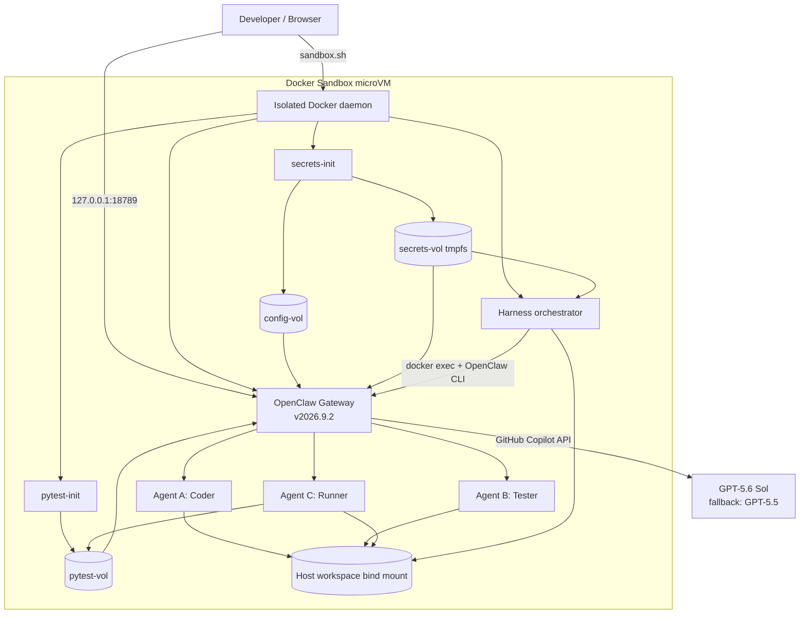

# OpenClaw Agent Harness · Self-Loop Testing Pipeline

> **Agent A writes the code → Agent B writes the tests → Agent C runs them in the OpenClaw sandbox and feeds back the results**
>
> Everything runs inside a [Docker Sandbox](https://docs.docker.com/ai/sandboxes/) microVM, using the **OpenClaw v2026.9.2** Docker Gateway and **GPT-5.6 Sol** through GitHub Copilot.

---

## What it is

A small multi-agent pipeline brought up with Docker Compose inside an isolated Docker Sandbox microVM. Three non-overlapping agents collaborate through a shared [OpenClaw Workspace](https://docs.openclaw.ai/concepts/agent-workspace) to complete a self-contained code → test → run → feedback loop:

| Agent | Role | Tools (allowlist) |
|-------|------|-------------------|
| **Agent A — Coder** 🧑‍💻 | Reads `SPEC.md` and writes the implementation to `solution.py`. If a failure report exists from the previous round, follow the "Suggested Fixes" section to repair it. | `read`, `write`, `edit` |
| **Agent B — Tester** 🧪 | Reads the spec and the implementation, then writes pytest cases to `test_solution.py`. | `read`, `write`, `edit` |
| **Agent C — Runner** 🏃 | Runs pytest inside the [OpenClaw Multi-Agent Sandbox](https://docs.openclaw.ai/tools/multi-agent-sandbox-tools) and writes the pass/fail results to `RUN_REPORT.md`. | `read`, `write`, **`exec`** |

Only Agent C has the `exec` tool, and `tools.exec.allowedPaths` strictly scopes execution to the single sub-directory `workspace/code/`.

Reference docs:

- Install: <https://docs.openclaw.ai/install/docker>
- Docker Sandboxes: <https://docs.docker.com/ai/sandboxes/>
- Multi-agent sandbox tools: <https://docs.openclaw.ai/tools/multi-agent-sandbox-tools>
- Workspace concept: <https://docs.openclaw.ai/concepts/agent-workspace>
- GitHub Copilot provider: <https://docs.openclaw.ai/providers/github-copilot>

Inspired by: <https://github.com/kinfey/Multi-AI-Agents-Cloud-Native/tree/main/code/openclaw_security>

---

## Directory layout

```
OpenClaw_AgentHarness/
├── README.md                ← this file
├── README.zh.md             ← Chinese documentation
├── docker-compose.yml       ← init services + OpenClaw Gateway + harness
├── sandbox.sh               ← Docker Sandbox deployment and operations
├── .env.example             ← image, model credential, and loop settings
├── setup.sh                 ← one-shot bootstrap
├── docs/
│   └── architecture.excalidraw ← editable project architecture diagram
├── config/
│   └── openclaw.json        ← read-only template: agents + Copilot provider + tool allowlists
├── security/
│   └── secrets-init.sh      ← prepares runtime config and Gateway token
├── workspace/               ← OpenClaw Agent Workspace (mounted at /home/node/.openclaw/workspace inside the container)
│   ├── AGENTS.md
│   ├── IDENTITY.md
│   └── code/
│       └── SPEC.md          ← task specification (ships with a sample: balanced-brackets function)
└── harness/
    ├── Dockerfile
    ├── requirements.txt
    ├── openclaw_client.py   ← wrapper around the OpenClaw Gateway
    └── orchestrator.py      ← self-loop driver: A → B → C → feedback → A …
```

---

## Architecture

The system separates the host control plane from the agent runtime. The host only runs `sbx`; Docker Compose and the Docker Socket live inside the Docker Sandbox microVM.



Editable source: [docs/architecture.excalidraw](docs/architecture.excalidraw).

### Component responsibilities

| Layer | Component | Responsibility |
|-------|-----------|----------------|
| Host control plane | `sandbox.sh` | Creates the microVM, applies minimal network policy, forwards port `18789`, and executes lifecycle commands. |
| Isolation boundary | Docker Sandbox | Provides a dedicated microVM, Docker daemon, filesystem, and network policy. |
| Initialization | `secrets-init` | Copies the tracked OpenClaw template into `config-vol` and atomically injects the runtime Gateway token. |
| Initialization | `pytest-init` | Installs pinned `pytest==8.3.5` from the Microsoft PyPI proxy into `pytest-vol`. |
| Agent runtime | OpenClaw Gateway | Hosts the three agents, enforces their tool profiles, and calls GitHub Copilot GPT models. |
| Orchestration | Harness | Runs Coder → Tester → Runner, validates output files, parses `RUN_REPORT.md`, and retries failures. |
| Shared data | `workspace/` | Stores the specification, generated implementation, tests, and run report. |

### Trust and persistence boundaries

- The macOS host exposes only the project workspace and forwarded port `18789` to the microVM.
- `/var/run/docker.sock` belongs to the microVM's Docker daemon; the harness cannot control host containers.
- `config/openclaw.json` is a credential-free template. The live token exists only in the runtime volumes.
- `secrets-vol` is tmpfs-backed; `config-vol` and `pytest-vol` persist while the Compose volumes exist.
- Only Runner can execute commands. Coder and Tester are limited to workspace file operations.

---

## A complete run

```
┌─────────────────────────────────────────────────────────────────────┐
│  iteration N                                                        │
│                                                                     │
│  orchestrator → docker exec → OpenClaw CLI --agent coder            │
│      ↳ Agent A reads SPEC.md (+ previous RUN_REPORT.md) → writes    │
│        solution.py                                                  │
│                                                                     │
│  orchestrator → docker exec → OpenClaw CLI --agent tester           │
│      ↳ Agent B reads SPEC.md + solution.py → writes                 │
│        test_solution.py                                             │
│                                                                     │
│  orchestrator → docker exec → OpenClaw CLI --agent runner           │
│      ↳ Agent C runs pytest from the read-only /opt/pytest volume    │
│        → writes RUN_REPORT.md (PASS / FAIL + Suggested Fixes)       │
│                                                                     │
│  orchestrator parses the report:                                    │
│      PASS → exit, status code 0                                     │
│      FAIL → enter iteration N+1 (Agent A reads the failure reason   │
│             and continues fixing)                                   │
└─────────────────────────────────────────────────────────────────────┘
```

---

## Versions

| Component | Version / model |
|-----------|-----------------|
| OpenClaw | `v2026.9.2` |
| Docker Sandboxes | `v0.42.1` or later |
| GitHub Copilot model | `github-copilot/gpt-5.6-sol` |
| Fallback model | `github-copilot/gpt-5.5` |

OpenClaw uses date-based release numbers rather than SemVer. There is no official `2.0` image tag; this repository treats the current stable `v2026.9.2` release as the requested 2.0 upgrade target and pins the image to avoid unreviewed `latest` upgrades.

## Quick start with Docker Sandbox

### 1. Install or upgrade Docker Sandboxes

Docker Sandboxes on macOS requires Apple silicon and macOS 14 or later.

```bash
brew trust docker/tap
brew install docker/tap/sbx
# Existing installation:
brew upgrade docker/tap/sbx
sbx login
```

Docker Desktop is not required for `sbx`. Each sandbox has its own Docker daemon, filesystem, and network.

### 2. Get a GitHub Copilot token

OpenClaw's [github-copilot provider](https://docs.openclaw.ai/providers/github-copilot) uses `github-copilot/gpt-5.6-sol`. Obtain a GitHub token that has Copilot access:

```bash
# Easiest path if you already have gh CLI installed and signed in:
gh auth token
```

The deployment script reads `COPILOT_GITHUB_TOKEN` from the environment, or securely invokes `gh auth token` without printing the token.

```bash
cd OpenClaw_AgentHarness
export COPILOT_GITHUB_TOKEN="$(gh auth token)"
```

Model availability depends on the GitHub Copilot plan and organization policy. The account must have access to GPT-5.6 Sol.

### 3. Deploy locally

```bash
chmod +x setup.sh sandbox.sh security/secrets-init.sh
./sandbox.sh deploy
```

This creates a sandbox named `openclaw-agent-harness`, allocates 4 CPUs and 8 GiB RAM, publishes port `18789`, adds narrowly scoped egress rules for the Microsoft Python package proxy, builds the harness image, and starts the OpenClaw Gateway. Open the Control UI at:

```bash
http://127.0.0.1:18789/
```

Override sandbox resources when needed:

```bash
OPENCLAW_SANDBOX_CPUS=6 OPENCLAW_SANDBOX_MEMORY=12g ./sandbox.sh deploy
```

### 4. Run one pipeline

```bash
./sandbox.sh run
```

Expected log:

```
━━━━━━ Iteration 1/3 ━━━━━━
[openclaw_client] → agent='coder' ...
[openclaw_client] ← agent='coder' (XXX chars)
[openclaw_client] → agent='tester' ...
[openclaw_client] ← agent='tester' (XXX chars)
[openclaw_client] → agent='runner' ...
[openclaw_client] ← agent='runner' (XXX chars)
>>> Iteration 1 status: PASS
✅ Tests passed — pipeline complete.
```

In the end, `workspace/code/` will contain:

- `solution.py` — Agent A's code
- `test_solution.py` — Agent B's pytest cases
- `RUN_REPORT.md` — Agent C's execution report

### 5. Try a different task

Edit [workspace/code/SPEC.md](workspace/code/SPEC.md), delete `solution.py / test_solution.py / RUN_REPORT.md`, and run `./sandbox.sh run` again.

### Operations

| Command | Purpose |
|---------|---------|
| `./sandbox.sh status` | Show the microVM and Compose services |
| `./sandbox.sh dashboard` | Copy the Gateway token and open the authenticated Control UI |
| `./sandbox.sh logs` | Follow OpenClaw Gateway logs |
| `./sandbox.sh shell` | Open a shell inside the microVM |
| `./sandbox.sh down` | Stop Compose services but retain the microVM |
| `sbx stop openclaw-agent-harness` | Stop the microVM |
| `sbx rm openclaw-agent-harness` | Delete the microVM and its internal images |

---

## Key design points

### Model — GitHub Copilot GPT-5.6 Sol

In `config/openclaw.json`:

```json
"agents": {
  "defaults": {
    "model": {
      "primary": "github-copilot/gpt-5.6-sol",
      "fallbacks": ["github-copilot/gpt-5.5"]
    }
  }
}
```

The provider-level configuration uses OpenClaw's built-in `github-copilot` plugin. Authentication comes from the `COPILOT_GITHUB_TOKEN` environment variable (also mirrored to `GH_TOKEN` to match the plugin's multi-source detection order). GPT models use OpenClaw's OpenAI Responses transport.

### Agent tool separation

```json
"agents": {
  "entries": {
    "coder":  { "tools": { "deny": ["exec", "process", "browser"] } },
    "tester": { "tools": { "deny": ["exec", "process", "browser"] } },
    "runner": { "tools": { "deny": ["process", "browser", "edit"] } }
  }
}
```

OpenClaw 2026.9.2 uses keyed `agents.entries`. Coder and Tester cannot execute processes; Runner can execute pytest but cannot edit the implementation through the `edit` or `apply_patch` tools.

### Runtime configuration and token handling

The `security/secrets-init.sh` container runs before the Gateway. It copies the tracked `config/openclaw.json` template into `config-vol`, reuses the token while `secrets-vol` exists, and atomically injects it into the runtime copy. Live credentials are never written back into the Git working tree.

### Docker Sandbox isolation

The Compose stack runs inside a Docker Sandbox microVM instead of directly against the host Docker daemon. The harness still mounts `/var/run/docker.sock` so it can call the OpenClaw CLI with `docker exec`, but that socket now belongs to the sandbox's isolated Docker daemon and cannot control host containers.

### Workspace = single source of truth

The host `./workspace/` directory is bind-mounted into both:

- The OpenClaw container at `/home/node/.openclaw/workspace` (where the agents read and write)
- The harness container at `/workspace` (where the orchestrator reads and writes)

This means `orchestrator.py` can immediately verify, from the host's view, that an agent actually produced its output file.

### Reproducible pytest runtime

`pytest-init` installs `pytest==8.3.5` into `pytest-vol` before OpenClaw starts. Runner executes:

```bash
PYTHONPATH=/opt/pytest python3 -m pytest test_solution.py -v --tb=short
```

The agent therefore does not install packages dynamically and cannot mutate the test toolchain.

---

## Troubleshooting

| Symptom | What to check |
|---------|---------------|
| `harness` is stuck at `Waiting for gateway` | Run `./sandbox.sh logs` and confirm the healthcheck returns 200. Usually `COPILOT_GITHUB_TOKEN` is missing or expired. |
| Control UI reports `gateway token missing` | Run `./sandbox.sh dashboard`; it copies the runtime token and opens an authenticated URL. |
| `agent 'coder' HTTP 401` | Token state is out of sync. Run `./sandbox.sh down && ./sandbox.sh deploy` to recreate the Gateway from the runtime config. |
| Runner reports `pytest not found` | Re-run `./sandbox.sh deploy`. The `pytest-init` service installs pinned pytest into the read-only `/opt/pytest` tool volume before OpenClaw starts. |
| Model not found | Confirm the Copilot account and organization policy allow `gpt-5.6-sol`. Inspect the live catalog with `sbx exec openclaw-agent-harness docker exec openclaw node /app/openclaw.mjs models list`. |
| `sbx` cannot start | Confirm Apple silicon, macOS 14+, `sbx login`, and at least 8 GiB free memory. |

---

## Shutdown

```bash
./sandbox.sh down
sbx stop openclaw-agent-harness
```

To remove all sandbox state, run `sbx rm openclaw-agent-harness`.
