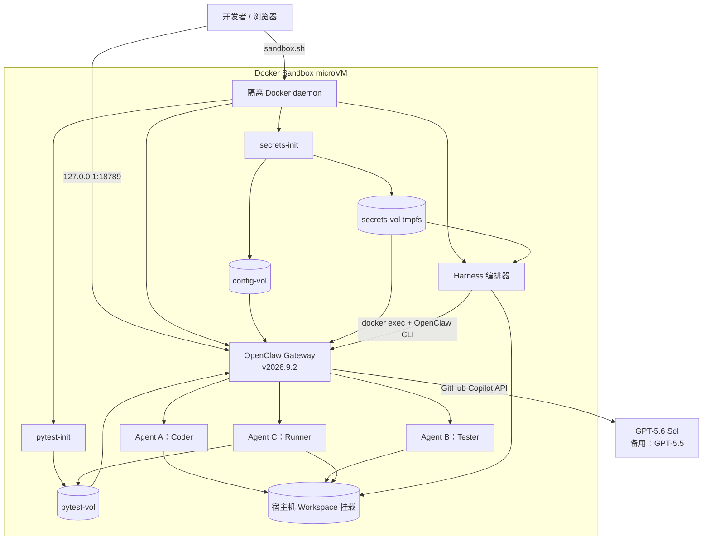

# OpenClaw Agent Harness · 自循环测试流水线

> **Agent A 写代码 → Agent B 写测试 → Agent C 在 OpenClaw 沙箱中执行并反馈**
>
> 全部运行在 [Docker Sandbox](https://docs.docker.com/ai/sandboxes/) microVM 中，使用 **OpenClaw v2026.9.2** Docker Gateway，并通过 GitHub Copilot 统一调用 **GPT-5.6 Sol**。

---

## 它是什么

一个在 Docker Sandbox 隔离 microVM 内用 Docker Compose 启动的小型多 Agent 流水线。三个互不越权的 Agent 通过共享的 [OpenClaw Workspace](https://docs.openclaw.ai/concepts/agent-workspace) 协作完成一项「自我闭环」的代码 → 测试 → 运行 → 反馈循环：

| Agent | 角色 | 工具集 (allowlist) |
|-------|------|-------------------|
| **Agent A — Coder** 🧑‍💻 | 读 `SPEC.md`，把实现写到 `solution.py`。如果上一轮有失败报告，按报告里的「Suggested Fixes」修复 | `read`, `write`, `edit` |
| **Agent B — Tester** 🧪 | 读规范 + 实现，把 pytest 用例写到 `test_solution.py` | `read`, `write`, `edit` |
| **Agent C — Runner** 🏃 | 在 [OpenClaw Multi-Agent Sandbox](https://docs.openclaw.ai/tools/multi-agent-sandbox-tools) 里执行 pytest，并把通过/失败结果写成 `RUN_REPORT.md` | `read`, `write`, **`exec`** |

只有 Agent C 拥有 `exec` 工具，并且通过 `tools.exec.allowedPaths` 把可执行范围严格限制在 `workspace/code/` 一个子目录里。

参考的官方文档：

- 安装：<https://docs.openclaw.ai/install/docker>
- Docker Sandboxes：<https://docs.docker.com/ai/sandboxes/>
- 多 Agent 沙箱工具：<https://docs.openclaw.ai/tools/multi-agent-sandbox-tools>
- Workspace 概念：<https://docs.openclaw.ai/concepts/agent-workspace>
- GitHub Copilot Provider：<https://docs.openclaw.ai/providers/github-copilot>

灵感来源：<https://github.com/kinfey/Multi-AI-Agents-Cloud-Native/tree/main/code/openclaw_security>

---

## 目录结构

```
OpenClaw_AgentHarness/
├── README.md                ← 英文说明
├── README.zh.md             ← 本文件
├── docker-compose.yml       ← 初始化服务 + OpenClaw Gateway + Harness
├── sandbox.sh               ← Docker Sandbox 部署与运维入口
├── .env.example             ← 把它复制成 .env 后填入 COPILOT_GITHUB_TOKEN
├── setup.sh                 ← 一键引导
├── docs/
│   └── architecture.excalidraw ← 可编辑项目架构图
├── config/
│   └── openclaw.json        ← 只读配置模板：Agent + Copilot Provider + 工具白名单
├── security/
│   └── secrets-init.sh      ← 准备运行时配置与 Gateway Token
├── workspace/               ← OpenClaw Agent Workspace（容器里挂在 /home/node/.openclaw/workspace）
│   ├── AGENTS.md
│   ├── IDENTITY.md
│   └── code/
│       └── SPEC.md          ← 任务规范（自带一个示例：括号匹配函数）
└── harness/
    ├── Dockerfile
    ├── requirements.txt
    ├── openclaw_client.py   ← 调用 OpenClaw Gateway 的封装
    └── orchestrator.py      ← 自循环主控，A → B → C → 反馈 → A …
```

---

## 项目架构

系统将宿主机控制面与 Agent 运行时分离。宿主机只运行 `sbx`；Docker Compose 和 Docker Socket 均位于 Docker Sandbox microVM 内部。



可编辑源文件：[docs/architecture.excalidraw](docs/architecture.excalidraw)。

### 组件职责

| 层级 | 组件 | 职责 |
|------|------|------|
| 宿主机控制面 | `sandbox.sh` | 创建 microVM、配置最小网络策略、转发 `18789` 端口并执行生命周期命令。 |
| 隔离边界 | Docker Sandbox | 提供独立 microVM、Docker daemon、文件系统和网络策略。 |
| 初始化 | `secrets-init` | 把 OpenClaw 配置模板复制到 `config-vol`，并原子注入运行时 Gateway Token。 |
| 初始化 | `pytest-init` | 从微软 PyPI 代理安装固定版本 `pytest==8.3.5` 到 `pytest-vol`。 |
| Agent 运行时 | OpenClaw Gateway | 承载三个 Agent、执行工具权限控制，并调用 GitHub Copilot GPT 模型。 |
| 编排 | Harness | 执行 Coder → Tester → Runner，检查产物、解析 `RUN_REPORT.md` 并在失败时重试。 |
| 共享数据 | `workspace/` | 保存任务规范、生成的实现、测试和运行报告。 |

### 信任与持久化边界

- macOS 宿主机只向 microVM 暴露项目 Workspace 和转发端口 `18789`。
- `/var/run/docker.sock` 属于 microVM 内部 Docker daemon，Harness 无法控制宿主机容器。
- `config/openclaw.json` 是无凭据模板；真实 Token 只存在于运行时卷。
- `secrets-vol` 基于 tmpfs；`config-vol` 和 `pytest-vol` 在 Compose 卷存在期间持久化。
- 只有 Runner 可以执行命令；Coder 和 Tester 仅能操作 Workspace 文件。

---

## 一次完整流程

```
┌─────────────────────────────────────────────────────────────────────┐
│  iteration N                                                        │
│                                                                     │
│  orchestrator → docker exec → OpenClaw CLI --agent coder            │
│      ↳ Agent A 读 SPEC.md (+ 上轮 RUN_REPORT.md) → 写 solution.py   │
│                                                                     │
│  orchestrator → docker exec → OpenClaw CLI --agent tester           │
│      ↳ Agent B 读 SPEC.md + solution.py → 写 test_solution.py       │
│                                                                     │
│  orchestrator → docker exec → OpenClaw CLI --agent runner           │
│      ↳ Agent C 使用只读 /opt/pytest 工具卷执行 pytest               │
│        → 写 RUN_REPORT.md (PASS / FAIL + Suggested Fixes)           │
│                                                                     │
│  orchestrator 解析报告:                                              │
│      PASS → 退出，状态码 0                                           │
│      FAIL → 进入 iteration N+1（Agent A 会读到失败原因继续修复）      │
└─────────────────────────────────────────────────────────────────────┘
```

---

## 版本

| 组件 | 版本 / 模型 |
|------|-------------|
| OpenClaw | `v2026.9.2` |
| Docker Sandboxes | `v0.42.1` 或更高版本 |
| GitHub Copilot 主模型 | `github-copilot/gpt-5.6-sol` |
| 备用模型 | `github-copilot/gpt-5.5` |

OpenClaw 使用日期版本号，而不是 SemVer。官方不存在 `2.0` 镜像标签；本项目将当前稳定版 `v2026.9.2` 作为本次 2.0 升级目标，并固定镜像版本，避免 `latest` 自动引入未经验证的变更。

## 使用 Docker Sandbox 快速开始

### 1. 安装或升级 Docker Sandboxes

macOS 需要 Apple silicon 与 macOS 14 或更高版本。

```bash
brew trust docker/tap
brew install docker/tap/sbx
# 已安装时：
brew upgrade docker/tap/sbx
sbx login
```

Docker Sandbox 不依赖宿主机 Docker Desktop。每个 Sandbox 都有独立的 Docker daemon、文件系统和网络。

### 2. 准备 GitHub Copilot Token

OpenClaw 的 [github-copilot Provider](https://docs.openclaw.ai/providers/github-copilot) 统一使用 `github-copilot/gpt-5.6-sol`。准备一份具备 Copilot 订阅的 GitHub Token：

```bash
# 已安装 gh CLI 且已登录的最简方式：
gh auth token
```

部署脚本优先读取环境变量，也可直接调用 `gh auth token`，且不会打印 Token：

```bash
cd OpenClaw_AgentHarness
export COPILOT_GITHUB_TOKEN="$(gh auth token)"
```

GitHub 账户和组织策略必须允许使用 GPT-5.6 Sol。

### 3. 本地部署

```bash
chmod +x setup.sh sandbox.sh security/secrets-init.sh
./sandbox.sh deploy
```

该命令会创建名为 `openclaw-agent-harness` 的 microVM，分配 4 CPU 与 8 GiB 内存，发布 `18789` 端口，为微软 Python 包代理添加最小出站白名单，构建 Harness 镜像并启动 OpenClaw Gateway。Control UI 地址：

```bash
http://127.0.0.1:18789/
```

### 4. 跑一轮流水线

```bash
./sandbox.sh run
```

期望日志：

```
━━━━━━ Iteration 1/3 ━━━━━━
[openclaw_client] → agent='coder' ...
[openclaw_client] ← agent='coder' (XXX chars)
[openclaw_client] → agent='tester' ...
[openclaw_client] ← agent='tester' (XXX chars)
[openclaw_client] → agent='runner' ...
[openclaw_client] ← agent='runner' (XXX chars)
>>> Iteration 1 status: PASS
✅ Tests passed — pipeline complete.
```

最终 `workspace/code/` 目录里会有：

- `solution.py` — Agent A 的代码
- `test_solution.py` — Agent B 的 pytest 用例
- `RUN_REPORT.md` — Agent C 的执行报告

### 5. 换一个题目

修改 [workspace/code/SPEC.md](workspace/code/SPEC.md)，删除 `solution.py / test_solution.py / RUN_REPORT.md`，再次执行 `./sandbox.sh run`。

### 常用操作

| 命令 | 用途 |
|------|------|
| `./sandbox.sh status` | 查看 microVM 与 Compose 服务 |
| `./sandbox.sh dashboard` | 复制 Gateway Token 并打开已认证的 Control UI |
| `./sandbox.sh logs` | 跟踪 OpenClaw Gateway 日志 |
| `./sandbox.sh shell` | 进入 microVM |
| `./sandbox.sh down` | 停止 Compose 服务但保留 microVM |
| `sbx stop openclaw-agent-harness` | 停止 microVM |
| `sbx rm openclaw-agent-harness` | 删除 microVM 及其内部镜像 |

---

## 关键设计要点

### 模型 — GitHub Copilot GPT-5.6 Sol

`config/openclaw.json` 中：

```json
"agents": {
  "defaults": {
    "model": {
      "primary": "github-copilot/gpt-5.6-sol",
      "fallbacks": ["github-copilot/gpt-5.5"]
    }
  }
}
```

Provider 级配置走 OpenClaw 的内置 `github-copilot` 插件，鉴权来自环境变量 `COPILOT_GITHUB_TOKEN`（同时同步到 `GH_TOKEN`，匹配插件的多源探测顺序）。三个 Agent 的主模型和备用模型都只使用 GPT 系列。

### Agent 工具隔离

```json
"agents": {
  "entries": {
    "coder":  { "tools": { "deny": ["exec", "process", "browser"] } },
    "tester": { "tools": { "deny": ["exec", "process", "browser"] } },
    "runner": { "tools": { "deny": ["process", "browser", "edit"] } }
  }
}
```

OpenClaw 2026.9.2 使用键值化的 `agents.entries`。Coder 和 Tester 无法执行进程；Runner 可以运行 pytest，但不能通过 `edit` 或 `apply_patch` 修改实现。

### 运行时配置与 Token

`security/secrets-init.sh` 在 Gateway 之前运行，把 `config/openclaw.json` 模板复制到 `config-vol`，在 `secrets-vol` 存续期间复用 Token，并以原子方式注入运行时副本。真实凭据不会写回 Git 工作树。

### Docker Sandbox 隔离

Compose 栈运行在 Docker Sandbox microVM 内，而不是直接连接宿主机 Docker daemon。Harness 仍挂载 `/var/run/docker.sock` 以执行 OpenClaw CLI，但该 Socket 属于 microVM 内部的隔离 Docker daemon，无法控制宿主机容器。

### Workspace = 单一可信源

宿主机 `./workspace/` 同时挂到：

- OpenClaw 容器里的 `/home/node/.openclaw/workspace`（Agents 读写）
- Harness 容器里的 `/workspace`（编排器读写）

所以 `orchestrator.py` 可以在 Agent 写完文件后立即在宿主机视图下检查产物是否生成。

### 可复现的 pytest 运行环境

`pytest-init` 在 OpenClaw 启动前把 `pytest==8.3.5` 安装到 `pytest-vol`。Runner 执行：

```bash
PYTHONPATH=/opt/pytest python3 -m pytest test_solution.py -v --tb=short
```

因此 Agent 不需要动态安装软件包，也不能修改测试工具链。

---

## 排错

| 现象 | 排查 |
|------|------|
| `harness` 卡在 `Waiting for gateway` | 执行 `./sandbox.sh logs`，确认 healthcheck 返回 200。一般是 `COPILOT_GITHUB_TOKEN` 没填或失效 |
| Control UI 提示 `gateway token missing` | 执行 `./sandbox.sh dashboard`，自动复制运行时 Token 并打开已认证地址 |
| `agent 'coder' HTTP 401` | Token 状态不一致。执行 `./sandbox.sh down && ./sandbox.sh deploy`，从运行时配置重新创建 Gateway |
| Runner 报 `pytest not found` | 重新执行 `./sandbox.sh deploy`。`pytest-init` 会在 OpenClaw 启动前把固定版本 pytest 安装到只读 `/opt/pytest` 工具卷 |
| 模型不存在 | 确认 Copilot 账户与组织策略允许 `gpt-5.6-sol`；可执行 `sbx exec openclaw-agent-harness docker exec openclaw node /app/openclaw.mjs models list` 查看实时模型目录 |
| `sbx` 无法启动 | 确认 Apple silicon、macOS 14+、已执行 `sbx login`，并至少有 8 GiB 可用内存 |

---

## 关闭

```bash
./sandbox.sh down
sbx stop openclaw-agent-harness
```

如需彻底删除所有 Sandbox 状态，执行 `sbx rm openclaw-agent-harness`。
